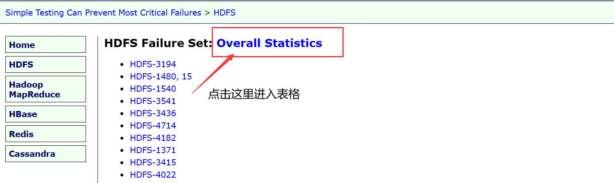
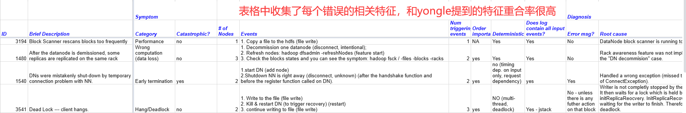

#### 项目思路
```
Todo:
1.Complete study: how error propagate in distributed systems and result in failures. One set of target distributed systems, how to select these systems
· how do we select failures which propagate through nodes or threads
   record features: cost, priority, events ......
· select the errors which is truly related to error propagation
2.More detail: when error detected , when error handled, and when system finished handing the errorCommunication

Goal: Find out the location of these events

Maybe there are other errors related to the failure
```

#### 我的想法:

---

&ensp;&ensp;我觉得大体思路上的理解应该都是相同的：筛选出有代表性的分布式系统软件->根据错误关键词筛选，收集可能发生错误传播的错误->筛选出真的发生错误传播的错误->研究筛选出的错误，开发错误发生位置定位工具

#### 每周任务
---
[week1 task](https://github.com/heatheart3/Error_trace/tree/master/weekly%20task/week1, "week1 task")

#### 补充

---

&ensp;&ensp;上面笔记里面两处不太清晰，因为当时记录的时候内容比较长，我没想好怎么概括。   
   
&ensp;&ensp;①record features: cost, priority, events ......
&ensp;&ensp;这里是在我们收集了错误之后，要记录一些错误的特征，建表分析。我觉得这个应该类似论文**Simple Testing Can Prevent Most Critical Failures**提供的数据库**https://www.eecg.toronto.edu/failureAnalysis/index.html**。
&ensp;&ensp;在他提供的数据库中，每个模块都提供了一个记录错误特征的表格，内容和yongle讲的很类似，我们觉得我们初期就对照这个表格收集的特征来进行建表即可。


   
&ensp;&ensp;②Maybe there are other errors related to the failure
&ensp;&ensp;这里其实是在讲我们一般会碰到的难点，yongle当时讲了一个具体场景，我们追踪failure的过程中，可能有一些无关紧要的错误，但是不是root cause。我们要思考如何让我们工具在定位的时候避免追踪一些没用的错误。